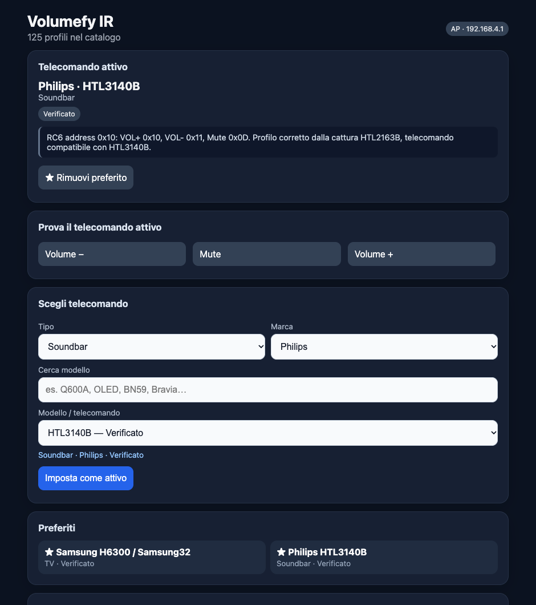

# Volumefy · BLE + IR

Una manopola per il volume. Un click per il silenzio. Due modi per controllare l'audio.

**Volumefy** è un controller con ESP32-C3 SuperMini, encoder KY-040 e trasmettitore infrarosso: regola volume e mute di un host Bluetooth LE oppure di TV, soundbar e impianti audio compatibili via IR. Il pannello web locale permette di scegliere il telecomando, salvare preferiti, provare i comandi e aggiornare il firmware.

[Sito e immagini](https://spacecdr.github.io/Volumefy/) · [Anteprima pannello](https://spacecdr.github.io/Volumefy/panel.html) · [Catalogo](CATALOG.md) · [Dettagli tecnici](TECHNICAL.md) · [Verifiche](TESTING.md)

Questa pubblicazione aggiorna la precedente versione solo BLE con il firmware locale **BLE + IR, RC6 Philips e OTA web**. Il sorgente applicativo è copiato senza modifiche dal progetto PlatformIO aggiornato. Le prove software e quelle ancora necessarie sul dispositivo sono distinte in TESTING.md.

## Scopo

Portare il controllo essenziale dell'audio sulla scrivania o accanto al divano: ruotare per il volume, premere per il mute. In BLE invia comandi multimediali al computer o telefono associato; in IR controlla l'apparecchio selezionato nel catalogo. Non trasmette musica, non misura il volume dell'apparecchio e non apprende nuovi codici IR.

## Comandi

| Azione | Risultato |
| --- | --- |
| Ruotare l'encoder | Volume su/giù; verso invertito rispetto alla precedente versione BLE |
| Pressione breve | Mute/unmute al rilascio |
| Pressione di almeno 2 secondi | Salva il cambio BLE ↔ IR e riavvia |
| 120 secondi senza attività | Deep sleep, anche se alimentato via USB |
| Pressione durante lo sleep | Risveglio nella modalità memorizzata; il firmware attende il rilascio prima di accettare altri comandi |

Le modalità sono **esclusive**: in BLE il Wi-Fi è spento; in IR sono attivi trasmettitore e access point Wi-Fi, mentre BLE non viene inizializzato. Al primo avvio senza impostazioni salvate parte in BLE, con nome `Volumefy`.

## Pannello web

1. Passa alla modalità IR tenendo premuta la manopola per almeno 2 secondi.
2. Collegati alla rete **Volumefy-Setup**, password predefinita **12345678**.
3. Apri **http://192.168.4.1**. Il captive portal può aprirsi automaticamente; l'indirizzo diretto resta disponibile.
4. Scegli **Tipo → Marca → Modello**, premi **Imposta come attivo** e prova volume e mute puntando l'emettitore verso l'apparecchio.

Non serve un router né una connessione Internet. Il pannello non ha un login aggiuntivo: chi accede alla rete del dispositivo può cambiare impostazioni e caricare firmware. Il sito GitHub Pages è la presentazione pubblica; il pannello che controlla l'hardware è servito dall'ESP32.



- **Telecomando attivo:** marca, modello, tipo, stato e nota di compatibilità.
- **Catalogo:** 125 profili, suddivisi in 101 TV, 20 soundbar e 4 audio; ricerca del modello all'interno di tipo e marca selezionati.
- **Test:** tre pulsanti per VOL−, Mute e VOL+ del profilo attivo.
- **Preferiti:** aggiunta/rimozione del profilo attivo e richiamo rapido di quelli salvati.
- **Velocità IR 1×–6×:** regola le ripetizioni dei comandi volume; valore iniziale 2×. Non cambia la portante. Mute rimane una pressione logica e Sony conserva i frame minimi richiesti.
- **OTA:** caricamento di `firmware.bin`, avanzamento, messaggi di esito e riavvio automatico dopo il successo.
- **Memoria NVS:** modalità, profilo attivo, preferiti e velocità sopravvivono a spegnimento e deep sleep.

La sola consultazione dei filtri, eseguita nel browser, non rinnova il timer di inattività del dispositivo. Dopo lo sleep, premi la manopola e ricollegati alla rete se necessario. Il timeout viene sospeso durante la scrittura OTA.

## Compatibilità IR

Sono implementati NEC/NEC extended, Samsung32, RC5, **RC6 Mode 0**, Sony SIRC 12 bit e RCA 24 bit. Il catalogo distingue `Verificato`, `Famiglia compatibile`, `TV Remote mode`, `Community` e `Da provare`: **125 voci non equivalgono a 125 dispositivi collaudati**. Molti modelli condividono gli stessi codici. Lo stato “Verificato” è quello assegnato dal firmware alle fonti dei codici, non una certificazione di collaudo del singolo apparecchio.

Philips HTL3140B e HTL2163B/12 usano RC6 con address `0x10`: VOL+ `0x10`, VOL− `0x11`, Mute `0x0D`. Il profilo HTL3140B è derivato dalla cattura compatibile HTL2163B inclusa in `reference/`; sostituisce il precedente RC5. Consulta [CATALOG.md](CATALOG.md) per tutti i profili e le note.

## Hardware

| Componente | Funzione |
| --- | --- |
| ESP32-C3 SuperMini | Firmware, BLE HID, access point e web server |
| Encoder KY-040 con pulsante | Volume, mute e cambio modalità |
| Emettitore IR con stadio di pilotaggio | Invio dei comandi agli apparecchi |
| USB-C, collegamenti e massa comune | Alimentazione e prima programmazione |

| Segnale | Collegamento |
| --- | --- |
| Encoder CLK / DT / SW | GPIO2 / GPIO3 / GPIO4 |
| Encoder + / GND | 3,3 V / GND |
| Comando trasmettitore IR | GPIO5 |
| LED integrato, attivo LOW | GPIO8 |


Un LED IR nudo richiede transistor/MOSFET e resistenza dimensionata per LED e alimentazione; un modulo deve accettare un comando logico a 3,3 V. Non collegare carichi IR di potenza direttamente al GPIO. Verificare pull-up dell'encoder a 3,3 V e avvio con GPIO2 nelle diverse posizioni: è un pin di strapping. Lo schema non è un pinout fisico né uno schema elettrico dimensionato.

USB serve per alimentazione e programmazione. L'ESP32-C3 non offre HID USB nativo sulla periferica Serial/JTAG integrata ([Espressif](https://docs.espressif.com/projects/esp-idf/en/stable/esp32c3/api-guides/usb-serial-jtag-console.html)). Il livello batteria BLE è fisso a 100, non misurato; non sono dichiarate autonomia o portata IR.

## Compilazione e aggiornamento

Con PlatformIO Core installato:

```sh
pio run -e esp32-c3-devkitm-1
pio run -e esp32-c3-devkitm-1 -t upload
```

Aggiungi `--upload-port PORTA` se necessario. Il primo caricamento e la migrazione dalla versione solo BLE priva di OTA richiedono USB. È usata la tabella `default.csv` con due slot OTA.

Per gli aggiornamenti successivi, entra nel pannello in modalità IR, scegli `.pio/build/esp32-c3-devkitm-1/firmware.bin` e premi **Aggiorna firmware**. Mantieni alimentazione e collegamento durante l'upload. In BLE l'OTA web non è disponibile.

Dipendenze dirette fissate: Espressif32 6.5.0, NimBLE-Arduino 1.4.3, IRremoteESP8266 2.9.0 ed ESP32 BLE Keyboard al commit indicato in `platformio.ini`. Non è pubblicata una release binaria.

## Materiali e continuità

`src/` e `platformio.ini` contengono il firmware; `reference/` la cattura Philips; `docs/` il sito e l'anteprima del pannello; `tools/render_panel.py` rigenera l'anteprima dal C++ con un adattatore host. `TECHNICAL.md`, `CATALOG.md`, `TESTING.md` e `HANDOFF.md` documentano implementazione, compatibilità e stato.

Foto del KY-040 attribuita a Joy-IT; schermate del pannello generate dal codice con dati dimostrativi; illustrazioni dichiarate. Non sono disponibili foto originali del prototipo in questa pubblicazione. Fonti e diritti in [THIRD_PARTY.md](THIRD_PARTY.md). Nessuna licenza di riutilizzo è stata scelta per i materiali originali.
