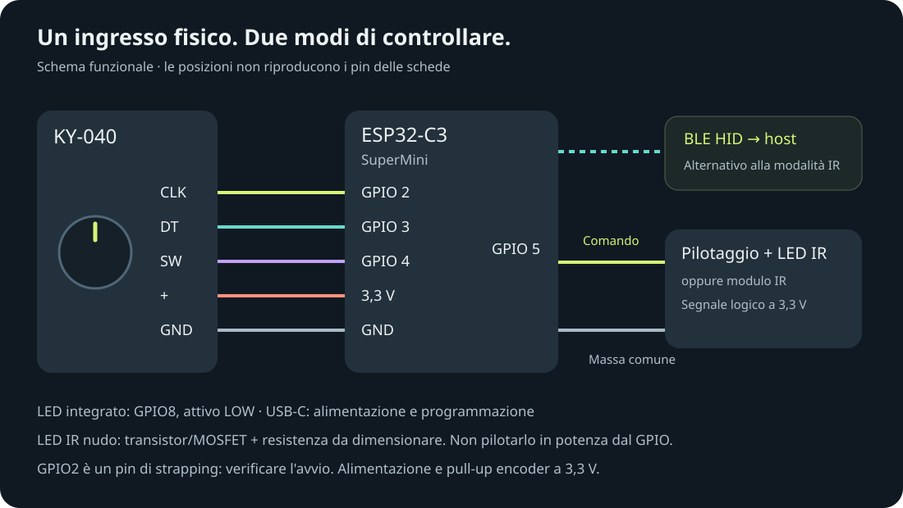

# Volumefy

Una manopola per il volume. Un click per il silenzio.

Progetto di controller Bluetooth con **ESP32-C3 SuperMini** e **KY-040**, pensato per comandare volume e mute del dispositivo collegato tramite BLE HID.

**Stato: specifica di progetto, firmware non ancora disponibile in questo repository.** Cablaggio e comportamento richiesto sono definiti; compilazione, installazione e collaudo hardware sono ancora da svolgere. Le funzioni descritte sono obiettivi, non risultati di test.

[Sito del progetto](https://spacecdr.github.io/Volumefy/) · [Descrizione tecnica](TECHNICAL.md) · [Piano di verifica](TESTING.md) · [Fonti e immagini](THIRD_PARTY.md)

## Funzionamento previsto

| Azione o stato | Comportamento richiesto |
| --- | --- |
| Ruota la manopola | Aumenta o diminuisce il volume |
| Premi la manopola | Mute / unmute |
| Associazione Bluetooth | Nome **Volumefy**, senza inserimento di PIN o password |
| Disponibile per la connessione | Un lampeggio LED ogni secondo |
| Connesso | Un lampeggio LED ogni 15 secondi |
| 120 secondi senza uso | Sleep con radio spenta |
| Premi durante lo sleep | Risveglio e nuova disponibilità Bluetooth |
| Dispositivo precedente assente | Consenti l'associazione con un altro dispositivo |

La riconnessione BLE è avviata dal computer o telefono: Volumefy dovrà conservare le chiavi di associazione e rendersi disponibile, ma non può obbligare l'host a riconnettersi. La compatibilità effettiva con ciascun sistema operativo deve essere verificata.

## Hardware e cablaggio

| Componente | Quantità | Ruolo |
| --- | --- | --- |
| ESP32-C3 SuperMini | 1 | Microcontrollore e radio Bluetooth LE |
| KY-040 con pulsante | 1 | Encoder incrementale e mute |
| Cavetti | 5 | Alimentazione e segnali |
| Cavo USB-C | 1 | Alimentazione e programmazione |

| Pin KY-040 | Pin ESP32-C3 |
| --- | --- |
| CLK | GPIO 2 |
| DT | GPIO 3 |
| SW | GPIO 4 |
| + | 3,3 V |
| GND | GND |

Questo è il cablaggio comunicato per il prototipo. I segnali devono rimanere a 3,3 V. Verificare le resistenze di pull-up del modulo concreto, incluso SW: le varianti KY-040 non sono tutte identiche.

GPIO2 è un pin di strapping. Una resistenza di pull-up non impedisce al contatto dell'encoder di portarlo basso: l'avvio va provato nelle diverse posizioni della manopola, inclusi reset e risveglio. Non considerare l'avvio garantito dal solo cablaggio. Il pin e la polarità del LED controllabile della SuperMini devono essere verificati sull'esemplare; il LED di alimentazione potrebbe non essere controllabile dal firmware.

## Uso via USB

La porta USB integrata dell'ESP32-C3 è **Serial/JTAG a funzione fissa**, non USB HID programmabile. Il solo cavo non consente quindi il funzionamento diretto come tastiera multimediale USB. [Documentazione Espressif](https://docs.espressif.com/projects/esp-idf/en/stable/esp32c3/api-guides/usb-serial-jtag-console.html).

Una possibile estensione è un ponte seriale sul computer che riceva gli eventi e regoli il volume, con implementazione specifica per sistema operativo. Questo ponte non è incluso. Per HID USB nativo insieme a BLE occorrerebbe invece rivedere l'hardware, per esempio usando un ESP32-S3.

## Foto e stato dei lavori

Il sito include una foto del KY-040 fornita da Joy-IT, caricata dalla fonte originale e attribuita. È un'immagine di riferimento del componente, **non una foto del prototipo Volumefy**. Schema e rappresentazione della manopola sono illustrazioni. Non sono disponibili foto originali del montaggio in questa pubblicazione.

Prossimi passi: implementare il firmware, verificare encoder e LED, provare pairing e riconnessione, misurare sleep e risveglio. Il [piano di verifica](TESTING.md) descrive le prove necessarie prima di dichiarare una release funzionante.

## Contenuto

- `TECHNICAL.md`: architettura proposta, gestione degli eventi e vincoli.
- `TESTING.md`: criteri di accettazione e stato delle verifiche.
- `docs/`: sito statico GitHub Pages e schema SVG.
- `THIRD_PARTY.md`: provenienza immagini e riferimenti.

Non è ancora scelta una licenza di riutilizzo per i materiali originali. La pubblicazione non attribuisce una licenza alle immagini di terzi.
